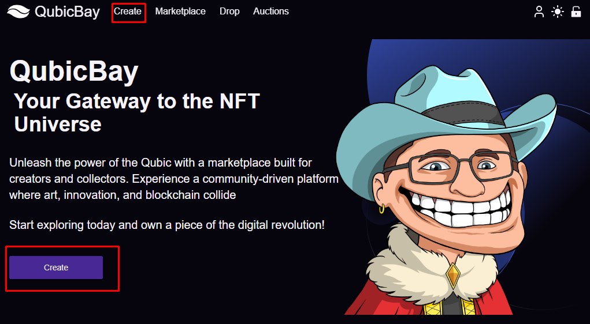
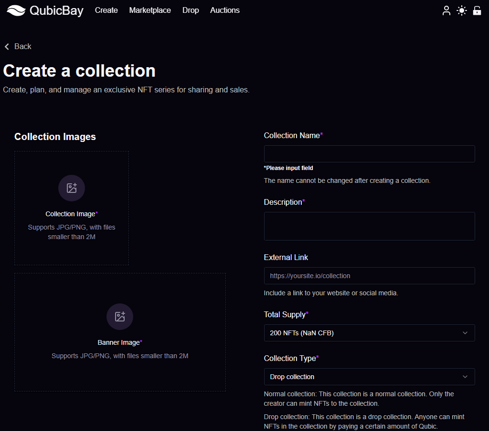
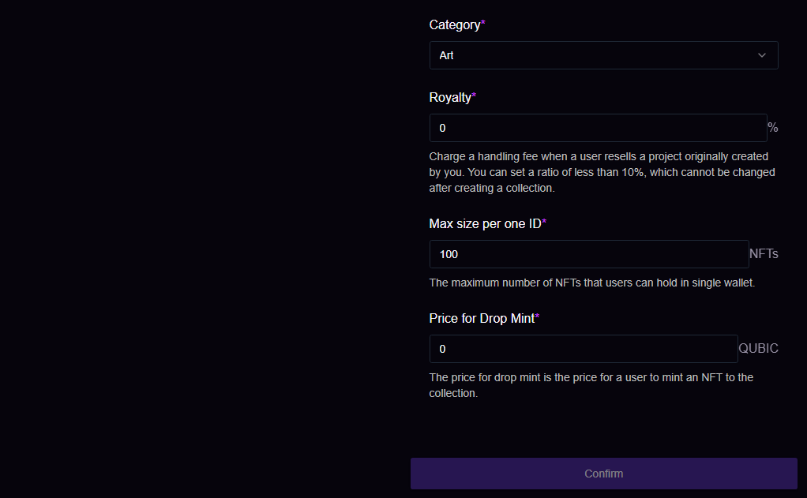

# Create a Collection

> To create an NFT collection, please click the `Create` button.\
>

<figure><figcaption></figcaption></figure>

> Access the `Create` a collection interface, follow the prompts to fill in the relevant information, then click the `Confirm` button.
>
> This will successfully create your collection, allowing for easier management and showcasing of your NFTs.

<figure><figcaption></figcaption></figure>

<figure><figcaption></figcaption></figure>
