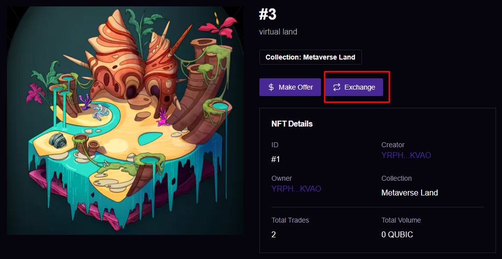
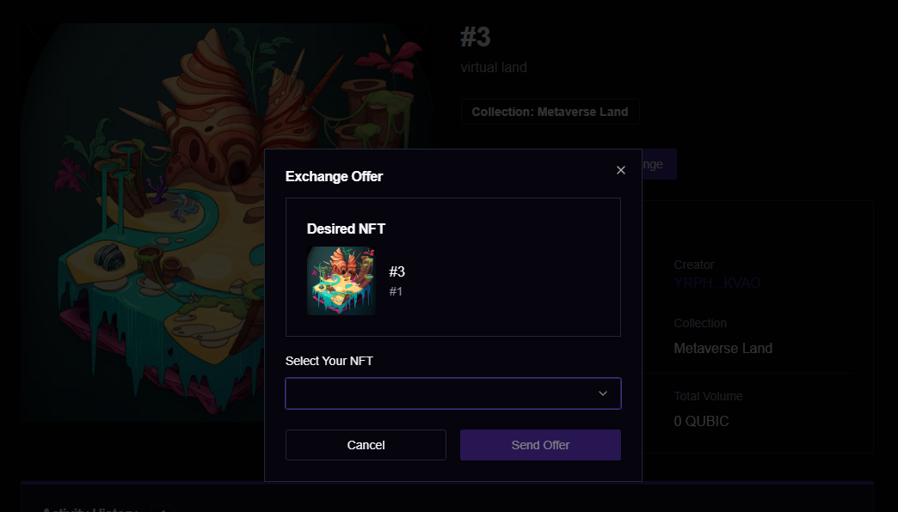

# Exchange

> If you are interested in NFTs that are not listed on the Marketplace, you can send an exchange offer to the owner of the NFT. Click the `Exchange` button.

<figure><figcaption></figcaption></figure>

> In the displayed model , select your own NFT that you want to exchange with the other person's NFT. Then click the `send offer` button.

<figure><figcaption></figcaption></figure>

> Will be notified whether the NFT owner has accepted or received your offer.
